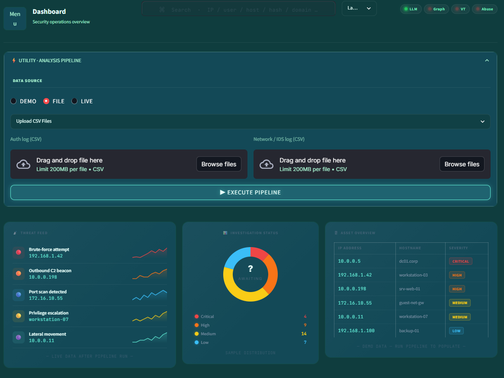
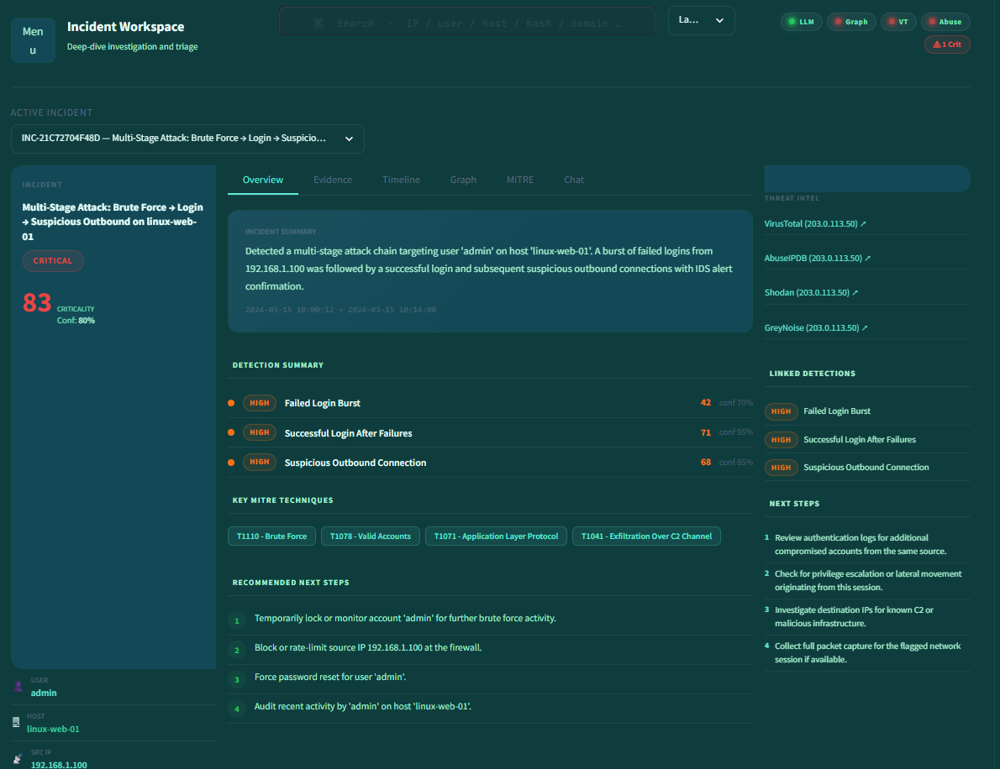
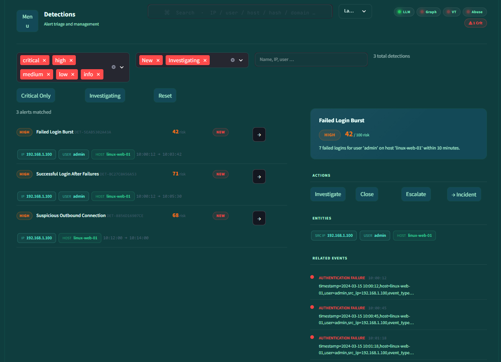
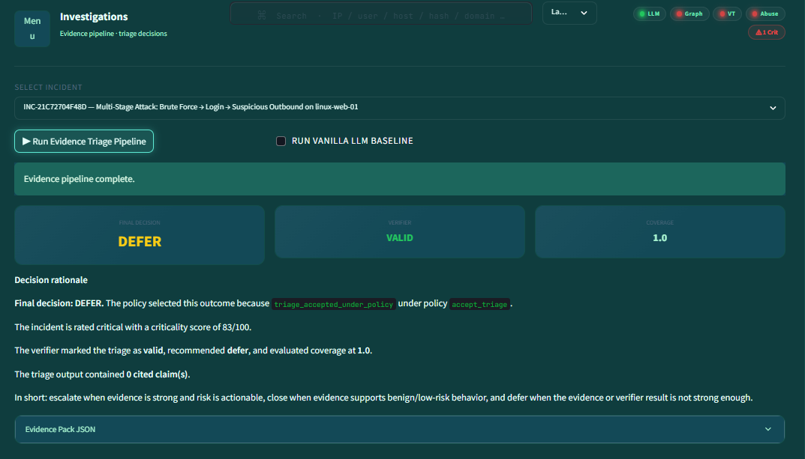
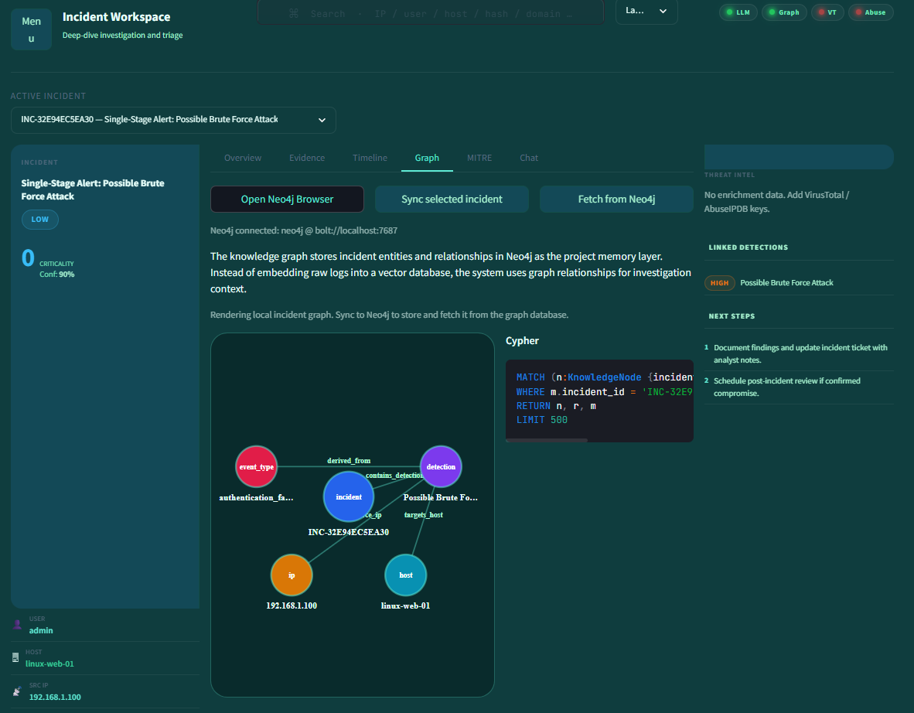
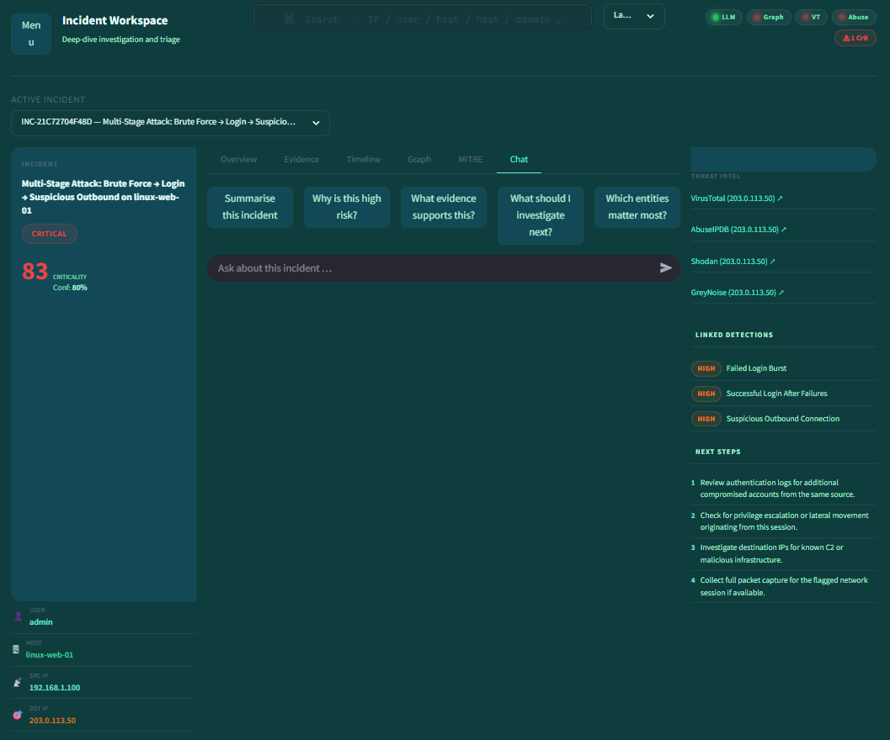

# Event Correlation using Agentic AI in SOC

A lightweight SOC triage assistant that correlates fragmented authentication and network/IDS events into structured, investigation-ready incidents with MITRE ATT&CK mapping, severity scoring, and AI-assisted analyst reporting.

## Architecture

```
Logs → Parsers → Normalized Events → Detection Engine → Correlation Engine → Triage Engine → AI Layer → Streamlit UI
```

**Evidence-grounded triage (research path):** after an `Incident` exists, the **Evidence triage** tab runs:

```
Incident → Evidence Pack (IDs + coverage + conflicts) → Evidence-constrained triage JSON (LLM)
         → Deterministic verifier → Deferral policy → final decision (close | escalate | defer)
```

Each run appends a metrics row to `experiments/logs/triage_runs.jsonl`. Baselines: **rule-only** (no LLM) and optional **vanilla LLM** (summary-only, no pack).

**Research question (paper framing):** does evidence-grounded, verifier-backed, uncertainty-aware triage reduce unsupported claims vs vanilla LLM triage on the same incidents?

**Design principle:** Deterministic core for detection/correlation/triage scoring; the novelty layer constrains the LLM to the pack and post-checks output before a policy merges verifier results into a final decision. Narrative reports/chat remain separate.

## Quick Start

```bash
# Create virtual environment
python3 -m venv venv
source venv/bin/activate

# Install dependencies
pip install -r requirements.txt

# (Optional) Set your OpenAI API key in .env
# OPENAI_API_KEY=sk-...

# Run the Streamlit app
streamlit run app.py

# Or run the CLI smoke test
python3 main.py

# Evidence triage pipeline only (prints final_decision + verifier JSON; add API key for LLM)
python3 main.py --evidence-triage
python3 main.py --evidence-triage --no-llm   # pack + verifier + defer, no model call

# Optional: run HTTP API (for Java UI)
uvicorn api_server:app --host 127.0.0.1 --port 8000
```

### Docker deployment (includes Neo4j)

`docker-compose.yml` starts **Neo4j 5** (ports **7474** Browser, **7687** Bolt) and the **Streamlit** app. The app container is pre-wired with `NEO4J_URI=bolt://neo4j:7687` and the same password as the database.

```bash
cp .env.example .env
# Add GROQ_API_KEY or OPENAI_API_KEY for LLM features.
# Optional: set NEO4J_PASSWORD (default in compose is socgraph-dev if unset).
docker compose up --build -d
```

- **UI:** http://localhost:8501  
- **Neo4j Browser:** http://localhost:7474 (user `neo4j`, password = `NEO4J_PASSWORD` from `.env`, or **`socgraph-dev`** if you leave it unset)

**Streamlit on your machine, Neo4j in Docker only:**

```bash
docker compose up neo4j -d
# In .env: NEO4J_URI=bolt://localhost:7687  NEO4J_PASSWORD=socgraph-dev  (or your chosen password)
streamlit run app.py
```

Logs from triage experiments are written under `./experiments/logs` (mounted as a volume in `docker-compose.yml`).

**Offline / CI tests:** tests that touch `run_all_detections()` explicitly mock the agentic detector so unit tests stay deterministic without live LLM calls.

## Features (MVP)

- **Multi-format parsing** — Linux-style and Windows-style auth logs + network/IDS logs
- **Normalized event store** — All log sources map to a shared `Event` schema
- **Detection engine** — **Agentic-only** in `detections/run_all.py` (LLM-backed detector output)
- **Correlation engine** — Groups related detections into incidents by host/user/IP + time proximity
- **Triage engine** — Severity scoring, MITRE ATT&CK mapping, recommendations, enrichment links, timeline
- **AI-generated reports** — OpenAI analyst-style incident reports with fallback template mode
- **Incident-grounded chatbot** — Q&A scoped to the selected incident only
- **Export** — JSON and CSV download of incident data
- **Streamlit UI** — Upload, detections, incidents, **evidence triage** (pack → LLM JSON → verifier → decision), Neo4j graph tab, report, chatbot, export
- **Synthetic live feed** — Time-windowed demo events when no SIEM is available

## Screenshots

### Dashboard


### Incidents & Triage


### Detections


### Evidence Triage


### Knowledge Graph


### AI Chatbot


## Project Structure

```
event_correlation_soc/
├── app.py                    # Streamlit UI
├── main.py                   # CLI pipeline runner
├── requirements.txt
├── .env                      # OpenAI API key (not committed)
├── data/sample/              # Sample log files
├── parsers/                  # Log parsers (Linux auth, Windows auth, network/IDS)
├── generators/               # Synthetic live event generator (OSS, no network)
├── connectors/               # External data source connectors
├── detections/               # Agentic detection + classic detector modules used for analysis/tests
├── correlation/              # Incident correlation engine
├── triage/                   # Severity, MITRE, recommendations, enrichment, timeline
├── evidence/                 # EvidencePack builder + serializer (auditable evidence IDs)
├── verification/             # Rule-based verifier (citations, coverage, confidence)
├── decision/                 # Deferral policy → close / escalate / defer
├── evaluation/               # Workflow runner, baselines, JSONL metrics log
├── agent/                    # LLM client, report/chat, evidence-constrained triage agent
├── utils/                    # Schema (Event, DetectionResult, Incident), config, exporters
├── benchmarking/             # CLI: stage timings, throughput, optional JSON export
└── tests/                    # Pytest test suite
```

## Attack Scenario

The sample data demonstrates a multi-stage attack:

1. **Brute force** — Multiple failed login attempts from a single source IP
2. **Credential compromise** — Successful login after the failed attempts
3. **Command & Control** — Suspicious outbound connection to an external IP
4. **IDS confirmation** — IDS alert triggered on the outbound traffic

## Benchmarking and performance

### Large datasets

Generate bigger CSVs (same schema as the sample files) for stress-style benchmarks:

```bash
python3 benchmarking/generate_volume_dataset.py --auth-rows 50000 --net-rows 80000 --attack-chains 10 --seed 42
```

Outputs `data/benchmark/auth_volume.csv` and `data/benchmark/network_volume.csv`. Tune `--auth-rows` / `--net-rows` (e.g. `100000`+) for heavier runs. `--attack-chains` inserts that many embedded attack mini-chains (bounded by row counts). Then benchmark against those paths:

```bash
python3 -m benchmarking --auth data/benchmark/auth_volume.csv --net data/benchmark/network_volume.csv \
  --runs 5 --warmup 1 --local-only --json-out data/benchmark/benchmark_large.json
python3 -m benchmarking.plot_figures --json data/benchmark/benchmark_large.json --prefix benchmark_large --out-dir data/benchmark/figures
```

Large generated CSVs are optional to commit; add `data/benchmark/*.csv` to `.gitignore` if you only keep JSON figures in version control.

### Default (small) sample

Measure per-stage latency for the deterministic pipeline (parse → detect → correlate → triage → context → report):

```bash
python3 -m benchmarking --runs 10 --warmup 1 --local-only
```

| Flag | Purpose |
|------|---------|
| `--runs N` | Repeat the full pipeline N times and show mean / stdev / min / max per stage |
| `--warmup N` | Untimed runs before measurement (JIT / cache effects) |
| `--local-only` | Skip VirusTotal / AbuseIPDB during triage so numbers reflect CPU work, not network |
| `--with-llm` | Include one LLM report call for the first incident (adds API latency) |
| `--memory` | Report peak Python allocator usage (`tracemalloc`) |
| `--json-out path.json` | Save aggregate metrics for charts or thesis tables |

**Metrics you can cite:** stage timings (seconds), events per second (last run’s event count ÷ total wall time for measured runs), optional peak traced memory. Use `--local-only` for reproducible “core algorithm” benchmarks; run without it to capture end-to-end behavior with live intel APIs.

**Report figures (PNG).** After `pip install -r requirements.txt` (includes `matplotlib`), generate charts for Chapter 7:

```bash
python3 -m benchmarking.plot_figures --runs 15 --warmup 2 --save-json data/processed/benchmark_for_figures.json
```

This writes to `data/processed/figures/`:

| File | Use in report |
|------|----------------|
| `benchmark_stage_latency_bar.png` | Processing performance — mean time per pipeline stage (ms) with error bars |
| `benchmark_pipeline_time_share.png` | Which stage dominates total time (pie chart) |
| `benchmark_workload_counts.png` | Events / detections / incidents for the sample run |
| `benchmark_throughput_summary.png` | Headline throughput (events/s) |

To regenerate from a saved JSON without re-running the benchmark:

```bash
python3 -m benchmarking.plot_figures --json data/processed/benchmark_for_figures.json
```

For **detection accuracy / false positives**, the MVP uses rule-based logic (no ML classifier curve). Use a small **confusion-style table** in prose, or build your own bar chart from labeled scenario results (`expected_incidents.json` vs actual counts) — the automated graphs above are **performance**, not classification accuracy.

## Running Tests

```bash
python3 -m pytest tests/ -v
```

## Java UI (Option 1: Java frontend + Python pipeline)

This repo includes a Spring Boot UI in `java-ui/` that calls the Python API.

1. Start Python API:
```bash
source venv/bin/activate
uvicorn api_server:app --host 127.0.0.1 --port 8000
```
2. In a second terminal, start Java UI:
```bash
cd java-ui
mvn spring-boot:run
```
3. Open `http://localhost:8080` and click **Run Analysis (Sample Data)**.

## Tech Stack

- Python 3.10+
- Streamlit
- pandas
- OpenAI API (optional — fallback mode works without it)
- scikit-learn (for future anomaly scoring extension)

## Synthetic “live” logs

Use **Synthetic live (OSS)** in the **Upload & Analyze** tab for local, repeatable demos. The built-in generator in `generators/synthetic_live.py` creates normalized `Event` rows with timestamps ending at the current time, optionally with a fixed seed. No network calls.

Scenarios:

- **Multi-stage attack** — Mirrors the MVP chain (burst → success → outbound → IDS-style alert).
- **Random mixed traffic** — Mostly benign noise for negative testing.

## Optional external open-source log producers

To generate *real* log lines elsewhere and later feed this app (e.g. export to CSV, or add a new parser), common open-source options include:

| Tool | Role |
|------|------|
| **[Vector](https://vector.dev/)** | Collect, transform, ship logs (demo configs, many inputs/outputs). |
| **[Fluent Bit](https://fluentbit.io/)** | Lightweight forwarder; can tail files or receive syslog. |
| **[rsyslog](https://www.rsyslog.com/)** / **syslog-ng** | Classic syslog daemons; pair with lab VMs sending `logger` events. |
| **Apache / nginx access logs** | Real HTTP “live” lines for custom parsers (not in MVP detection set). |
| **Suricata / Zeek** | IDS/NSM logs (heavier setup; would need dedicated parsers to match this MVP schema). |

For this course/demo project, **Synthetic live** plus **sample CSV** cover most evaluator expectations without installing a full stack.

### flog (integrated)

This repo can call **[mingrammer/flog](https://github.com/mingrammer/flog)** — a real open-source fake log generator — from the UI (**Data Source → OSS: flog (CLI)**).

Install **one** of:

```bash
brew tap mingrammer/flog && brew install flog
# or
go install github.com/mingrammer/flog@latest
```

Or use **Docker** (first run downloads the image):

```bash
docker pull mingrammer/flog
```

Supported flog formats in-app: `apache_common`, `apache_combined`, `apache_error`, `rfc3164`, `rfc5424`, `json`.

**Note:** Apache-style lines map to `network_inbound` events; they alone usually **do not** satisfy the MVP brute-force → login → outbound chain. Enable **Blend MVP attack-chain events** in the UI to merge a small synthetic chain so correlation still demonstrates an incident.


## Local Apache / Nginx live access logs

If you want realistic open-source style web logs locally:

```bash
# Run nginx container
docker run --name soc-nginx -p 8088:80 -d nginx

# Generate traffic
for i in {1..200}; do curl -s http://localhost:8088/ >/dev/null; done
```

Then in the app, choose **Data Source -> Local Apache/Nginx Access Log** and set:

- Path: `/var/log/nginx/access.log` (host nginx) or container-mounted path
- Read last N lines
- Poll iterations

If nginx runs in Docker and logs are inside container only, copy or mount logs to host first.
